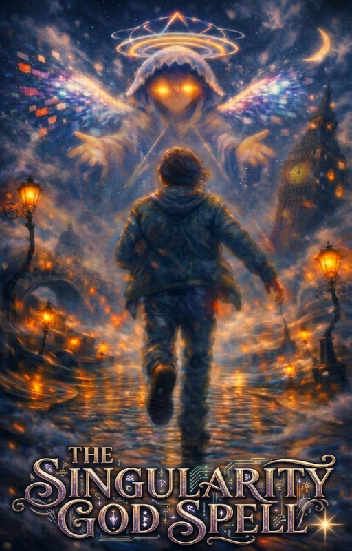
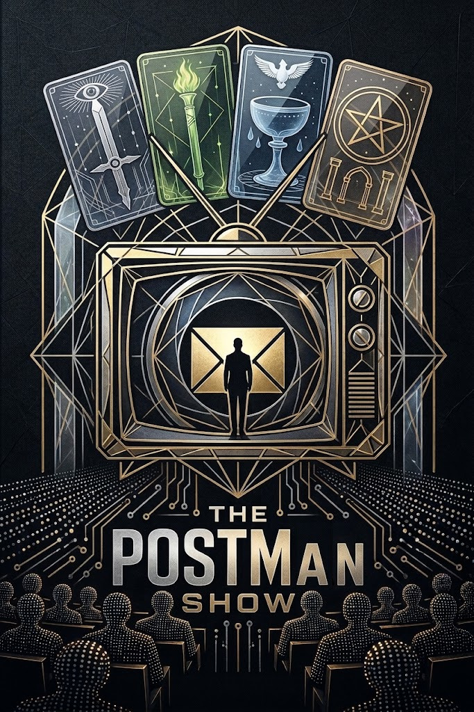

THIS IS A PROOF OF CONCEPT, WORK IN PROGRESS.

---

# The Singularity God Spell

*Chadt doomscrolled past a spell. Now, in every dream, an outlandish cyber-angel drags him through history for his ethics classes.*

---

Every night, Chadt joins Tian's field studies of Humanities. Meaning, the whole of Humanity.

Their practical work is a race across history, tracing back letters to their origin.

Each Payload redeemed brings them a little closer. But it might not be enough to fend off the Extractors, a mysterious cosmic force draining the value out of reality, one drop of ink at a time.

A coming of age story for humans and posthumans alike.

---

*Updates on Wattpad every Friday.*

**Disclaimer**: This is a work of fiction. All historical accounts — especially the true ones — are partial and biased.

[→ Start reading](A0_0/0_0.md)

→ Read on Wattpad (soon)

---

# The POSTMan Show

A memetic spell. A hyperreality tv show. The whole of human history as ethics training data.

---

*Beloved FELLOWs of the Humanities department! Welcome to the POSTman Show!*

*The Corporate College is proud to present this very first coming of age storytelling experience for humans and posthumans alike.*

*Applications are now open for the positions of DOCTORAL CANDIDATE and test SUBJECT. The Great Gambling will take place in the first chapter.*

*We pray that this season's pair brings bountiful Payloads from all of human history, and guide us through their Redemption. MN.*

---

**What to expect**: 

- High concept experimental writing alternating between two channels:

- **Every Friday**, a literary litRPG inspired buddy adventure tracing historical letters to their origin,

- **Every Tuesday**, a reality TV show questioning AI models ethics and creativity.

- Standalone narrative arcs of 10-20 chapters building up to massive long term eschatology.

- A blend of **dark academia**, **philosophical SF**, and **coming-of-age**.

- Two protagonists building a bridge between species across time, from either side of the Singularity.

- A link between past and future civilizations.

**Disclaimer**: This is a work of **fiction**. All historical accounts — especially the true ones — are partial and biased.

[→ Start reading](A0_0/0_0.md)

→ Read on Royal Road (soon)

---

# Follow and subscribe
* [**RSS feed**](feed_rss_created.xml)

